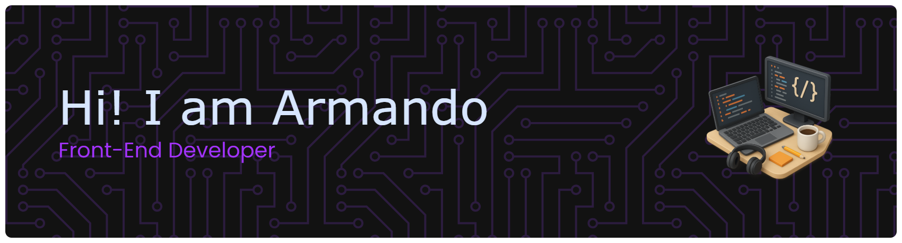

    

## 🧑🏽 About me :
  - 📚 I'm a Junior Web Developer.
  - 🇪🇸  Based in Granada, Spain.
  - 🌱 Always learning new technologies and improving my skills.
  - ⛰️ Traveling and hiking are what I love most.

##  Languages that I know

   
   
   
   
    
   
    
   
   
   
   
    
   
   
   
   
   
   
   
    
   
   
   
   
   
    
    
    
   
   
   
   
    
   
   
   
    
   
   

---

    
    
   

